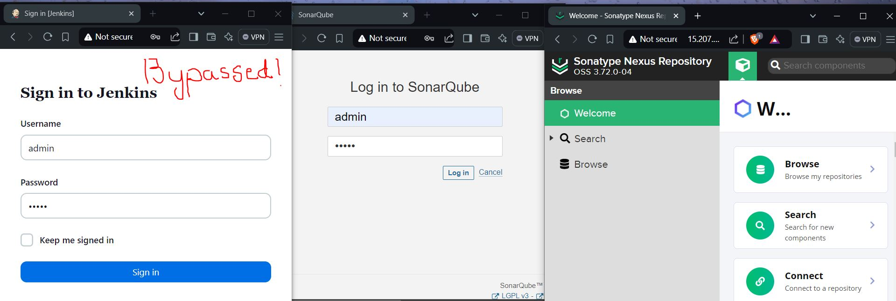
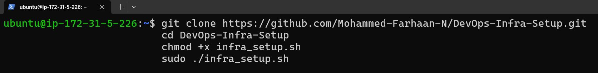
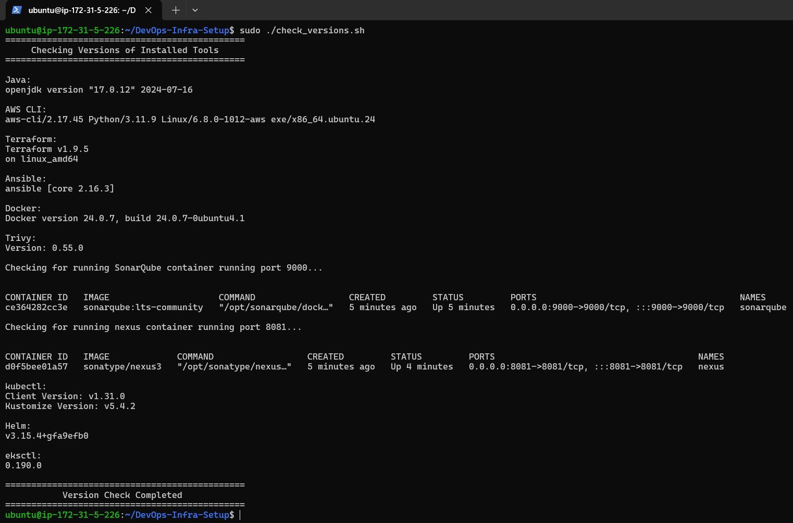

# DevOps-Infra-Setup 🚀

Frustrated with the complexity of setting up DevOps tools? Meet DevOps-Infra-Setup—a revolutionary script designed to automate and simplify the entire process. It streamlines the installation and configuration of critical DevOps infrastructure, letting you save time and focus on what truly matters.

Want to see how this script can transform your DevOps workflow? Dive in to discover its game-changing benefits! 

## 🎯 Features

- **Automated Setup Scripts**:
  - **Default Setup**: Installs Java, AWS CLI, Docker, Terraform, and Ansible.
  - **Jenkins Setup**: Installs and configures Jenkins only.
  - **Full CI/CD Environment**: Installs Jenkins, SonarQube, Trivy, and Nexus.
  - **Kubernetes Environment**: Sets up `kubectl`, Helm, and `eksctl` for managing Kubernetes clusters.
    
  
## 🔒 Security Note

- **Bypassed Jenkins!**: 

    Want to skip the usual Jenkins setup headaches? Our script bypasses the default admin password configuration, allowing you to get started right away. Here are the default credentials:

  - **Username**: `admin`
  - **Password**: `admin`

    Driven by curiosity, I just reverse-engineered and successfully bypassed the Jenkins initial admin password setup😁😁😁😁😁😁😁

  
    
## 🛠 Getting Started

Ready to see it in action? Follow these steps to transform your DevOps setup:
    
 1. **Clone the Repository and Run the Setup Script:**
   
    ```bash
        git clone https://github.com/Mohammed-Farhaan-N/DevOps-Infra-Setup.git
        cd DevOps-Infra-Setup
        chmod +x infra_setup.sh
        sudo ./infra_setup.sh
     ```
    

## ⚙️ Usage

Choose the script based on your needs:

- **Install Jenkins only**:
    ```bash
    sudo ./jenkins.sh
    ```

- **Install Full CI/CD Environment (Jenkins, SonarQube, Trivy, Nexus)**:
    ```bash
    sudo ./full-CI-CD-setup.sh
    ```

- **Set up Kubernetes Environment (kubectl, Helm, eksctl)**:
    ```bash
    sudo ./Kube_setup.sh
    ```

- **Verify all tools are installed**:
    ```bash
    sudo ./check_versions.sh
    ```
    

## 🛡 Notes

- Compatibility: Designed for Ubuntu/Debian systems. Make sure your environment is compatible.
- Continuous Development: New features and enhancements are on the way! Keep an eye out for updates.

## 🤝 Contributing

Contributions are welcome! Please don't hesitate to create a pull request or report any issues.

## 📜 License

This open-source project is available under the [MIT License](LICENSE).

## 👤 Author

Created by [Mohammed Farhaan N](https://github.com/Mohammed-Farhaan-N) [Blog](https://mohammedfarhaan.hashnode.dev/mastering-devops-best-strategies-to-slash-time-and-costs)
